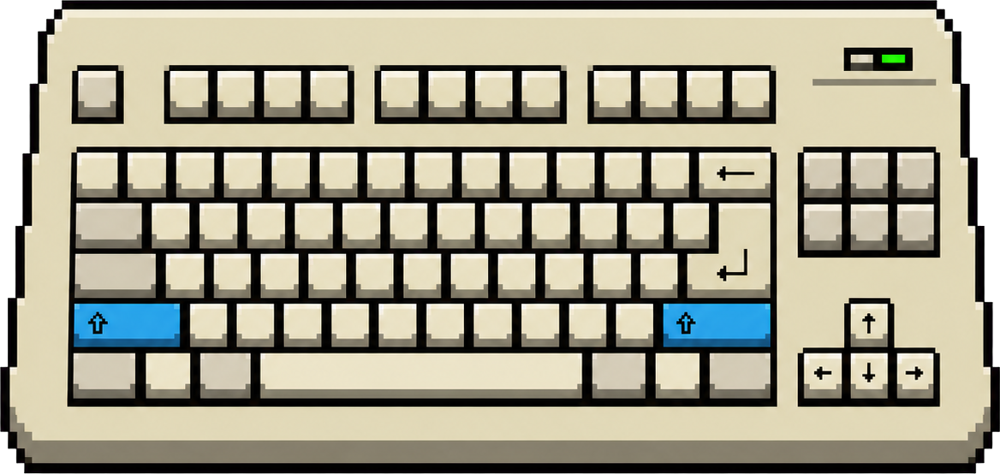

# dokey

[Русский](README.md) · **English**

A small Windows application that switches keyboard layouts using the **Shift** keys. By default, left Shift selects English and right Shift selects Russian; you can swap this assignment in Settings.

Pressing the same key repeatedly does not change the layout. You do not need to remember which language is currently active—press the appropriate **Shift** key and continue typing.

I first used this switching method in DOS with **KeyRus**, and later in Windows with **Punto Switcher**. Punto Switcher eventually became too heavyweight and inconvenient for this single task, so I created a small dedicated application.

## Installation

Download `dokey-win-Setup.exe` from the [Releases](https://github.com/dosoft/dokey/releases) page and run it. The application installs automatically. On its first launch, dokey enables autostart (a UAC prompt may appear) so that it starts with Windows. You can disable autostart in the application settings.

**Note:** the application and installer are not digitally signed yet, so Windows SmartScreen or Microsoft Defender may display a warning. This is expected—select “More info” → “Run anyway” to continue the installation.

## Usage

- By default, press **right Shift** to select the Russian layout.
- By default, press **left Shift** to select the English layout.
- Swap the left and right Shift assignments in Settings if needed.
- The tray icon shows the current layout of the active window.
- Double-click the tray icon to open Settings.

## Activation conditions

The layout changes only after a **clean** Shift press:

- no other key is pressed at the same time (Ctrl, Alt, Win, letters, arrows, and so on);
- no mouse button is clicked while Shift is held;
- if Shift is held for longer than 300 ms (configurable), the layout is not changed.

Normal Shift behavior—including Shift+letter, Shift+arrow, and Shift+click—is unaffected.

## Requirements

- Windows 10 or 11.
- RU (`0419`) and EN (`0409`) layouts installed in Windows language settings.
- The installer includes the .NET Runtime as part of the self-contained build.

## Updates

The application uses [Velopack](https://github.com/velopack/velopack). It checks for updates automatically and displays a tray notification when a new version is available.

## Known limitations

- **Elevated windows (UAC):** if the active window runs as administrator while dokey does not, layout switching will not work in that window. Run `dokey.exe` as administrator as well. The built-in autostart does this automatically.
- Only two layouts are supported: RU (`0x0419`) and EN (`0x0409`).

## Links

- [Releases and installer](https://github.com/dosoft/dokey/releases)
